# Landing Zone Architecture

Azure hub-and-spoke landing zone deployed via Terraform across three subscriptions.

---

## Subscriptions

| Name | ID | Purpose |
|------|----|---------|
| Management | `498ff788-a1a1-4860-a97f-3ee90d4fab61` | Hub VNet, DNS, shared services |
| Spoke 1 | `4d0f2de4-fd44-4c94-ab45-5d8f2d2b3720` | Workload environment 1 |
| Spoke 2 | `fa2293f5-402a-453a-a8da-0870c83a6122` | Workload environment 2 |

---

## Network topology



```
Management subscription
├── rg-VnetHub-internal-we
│   └── vnet-hub-internal-we  (10.0.0.0/16)
│       ├── Hub-mgmnt-subnet  (10.0.1.0/24)
│       └── Hub-pe-subnet     (10.0.2.0/24)
└── rg-DnsHub-internal-we
    └── privatelink.blob.core.windows.net
        ├── dns-link-hub
        ├── dns-link-spoke1
        └── dns-link-spoke2

Spoke 1 subscription
└── rg-VnetSpoke1-internal-we
    ├── vnet-spoke1-internal-we  (10.1.0.0/16)
    │   ├── subnet-01  (10.1.1.0/24)
    │   └── subnet-02  (10.1.2.0/24)
    ├── rt-spoke1-internal-we
    │   ├── 0.0.0.0/0  → Internet
    │   └── 10.0.0.0/16 → VnetLocal
    └── storage account  (stinternalspoke1we[random])

Spoke 2 subscription
└── rg-VnetSpoke2-internal-we
    ├── vnet-spoke2-internal-we  (10.2.0.0/16)
    │   ├── subnet-01  (10.2.1.0/24)
    │   └── subnet-02  (10.2.2.0/24)
    ├── rt-spoke2-internal-we
    │   ├── 0.0.0.0/0  → Internet
    │   └── 10.0.0.0/16 → VnetLocal
    └── storage account  (stinternalspoke2we[random])
```

**Peerings** (bidirectional):
- `vnet-hub` ↔ `vnet-spoke1`
- `vnet-hub` ↔ `vnet-spoke2`

---

## Running

```bash
# Terraform
./run.sh init
./run.sh plan
./run.sh apply
./run.sh destroy
```

Environment variables required in `.env`:

```bash
ARM_CLIENT_ID=...
ARM_CLIENT_SECRET=...
ARM_TENANT_ID=...
TF_TOKEN_app_terraform_io=...
```
